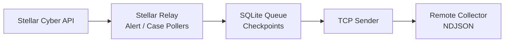

<h1 align="center">Stellar Relay</h1>

<p align="center">
  <strong>Stellar Cyber Alert와 Case를 안정적인 NDJSON Stream으로 전달합니다.</strong>
</p>

<p align="center">
  Stellar Cyber API를 polling하고, local queue/checkpoint를 유지하면서 활성화된 Alert/Case stream을 TCP collector로 전달하는 lightweight Python daemon입니다.
</p>

<p align="center">
  <a href="README.md">English</a> · <strong>한국어</strong> · <a href="https://stellar-relay.xdr.ooo/">제품 웹사이트</a>
</p>

<p align="center">
  
  
  
  
</p>

<p align="center">
  <strong>제품 웹사이트:</strong> <a href="https://stellar-relay.xdr.ooo/">stellar-relay.xdr.ooo</a>
</p>

---

## Stellar Cyber 데이터를 기존 Collector로 전달합니다

Stellar Relay는 **Stellar Cyber Alert와 Case**를 API에서 가져와 TCP를 통해 newline-delimited JSON으로 전달합니다.

Alert와 Case는 각각 독립적으로 활성화할 수 있습니다. 완전히 설정된 stream만 polling하며 local SQLite에 queue/checkpoint 상태를 유지합니다.

## 주요 기능

| 기능 | 설명 |
|---|---|
| **Alert Forwarding** | 설정한 interval로 Alert를 polling하고 TCP로 전달 |
| **Case Forwarding** | Case를 별도로 polling하고 summary/Kill Chain field 포함 가능 |
| **Reliable Local State** | `~/.local/state/stellar_alert_case/` 아래 SQLite queue/checkpoint |
| **NDJSON Output** | UTF-8, 한 줄에 하나의 JSON object |
| **Independent Stream** | Alert-only, Case-only, 또는 둘 다 사용 |
| **Backfill** | 명시적인 historical re-fetch mode |
| **Service Operation** | 장기 daemon 운영과 systemd 구성 지원 |

## Data Flow



## 빠른 시작

```bash
git clone https://github.com/xdr-labs/Stellar-Case-Alert-to-Sylog.git
cd Stellar-Case-Alert-to-Sylog
```

Alert only:

```bash
python3 Stellar_Alert_Case_Syslog.py \
  --alert-interval 60 \
  --alert-syslog-ip 10.10.10.20 \
  --alert-syslog-port 5201
```

Case only:

```bash
python3 Stellar_Alert_Case_Syslog.py \
  --case-interval 3600 \
  --case-syslog-ip 10.10.10.20 \
  --case-syslog-port 5142 \
  --case-include-summary \
  --no-case-format-summary \
  --case-fetch-timeout 90
```

최소 하나의 stream은 세 가지 필수 option(interval, destination IP, destination port)이 모두 설정되어야 합니다.

## Output Format

이 도구의 output은 historical repository/script naming과 달리 **RFC 5424 syslog text가 아니라 NDJSON over TCP**입니다.

```text
one JSON object
one line
UTF-8
LF terminated
```

Alert와 Case가 같은 destination port를 사용할 수도 있으며 receiver에서는 JSON field로 record type을 구분합니다.

## Local State

```text
~/.local/state/stellar_alert_case/
├── queue.db
├── logs/
└── stellar_alert_case.lock
```

## 문서

- **제품 웹사이트:** https://stellar-relay.xdr.ooo/
- 전체 CLI option, systemd 예제, backfill, troubleshooting: [README.md](README.md)

Credential은 code에 hard-code하지 말고 CLI option 또는 systemd environment file 등 외부 secret 전달 방식을 사용합니다.

---

<p align="center">
  <strong>Poll. Queue. Forward. Keep the streams independent.</strong>
</p>
