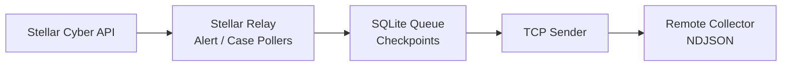

<h1 align="center">Stellar Relay</h1>

<p align="center">
  <strong>Forward Stellar Cyber alerts and cases as reliable NDJSON streams.</strong>
</p>

<p align="center">
  A lightweight Python daemon that polls Stellar Cyber, queues records locally, and forwards enabled Alert and Case streams to a TCP collector.
</p>

<p align="center">
  <strong>English</strong> · <a href="README.ko.md">한국어</a> · <a href="https://stellar-relay.xdr.ooo/">Product Website</a>
</p>

<p align="center">
  
  
  
  
</p>

<p align="center">
  <strong>Product website:</strong> <a href="https://stellar-relay.xdr.ooo/">stellar-relay.xdr.ooo</a>
</p>

---

## Bridge Stellar Cyber data to the collector you already use

Stellar Relay is a long-running Python daemon for forwarding **Stellar Cyber Alerts and Cases** to a remote collector over TCP as newline-delimited JSON.

Alert and Case streams are independently configurable. The daemon fetches only streams that are fully configured, stores queue/checkpoint state locally, and sends one JSON object per line.

## What it does

| Capability | What Stellar Relay provides |
|---|---|
| **Alert forwarding** | Poll Stellar Cyber Alerts on a configured interval and forward them over TCP |
| **Case forwarding** | Poll Cases independently, including optional summary/Kill Chain fields |
| **Reliable local state** | SQLite queue and checkpoints under `~/.local/state/stellar_alert_case/` |
| **NDJSON output** | UTF-8, newline-delimited JSON suitable for downstream collectors/parsers |
| **Independent streams** | Alert-only, Case-only, or both |
| **Backfill** | Explicit historical re-fetch mode for controlled testing/recovery workflows |
| **Service operation** | Long-running daemon model with a documented systemd deployment pattern |

## Data flow



## Quick start

Clone the repository and run the main daemon:

```bash
git clone https://github.com/xdr-labs/Stellar-Case-Alert-to-Sylog.git
cd Stellar-Case-Alert-to-Sylog

python3 Stellar_Alert_Case_Syslog.py \
  --alert-interval 60 \
  --alert-syslog-ip 10.10.10.20 \
  --alert-syslog-port 5201
```

For Case forwarding:

```bash
python3 Stellar_Alert_Case_Syslog.py \
  --case-interval 3600 \
  --case-syslog-ip 10.10.10.20 \
  --case-syslog-port 5142 \
  --case-include-summary \
  --no-case-format-summary \
  --case-fetch-timeout 90
```

At least one stream must be fully configured.

> Despite the historical repository/script naming, the output is **NDJSON over TCP**, not RFC 5424 syslog text.

For the product guide, installation flow, examples, and operational reference, start at **https://stellar-relay.xdr.ooo/**.

---

## Requirements

| Item | Detail |
|------|--------|
| OS | Linux |
| Python | 3.9+ |
| Packages | None (Python standard library only) |
| Network | Outbound HTTPS to Stellar host; outbound TCP to syslog destination |
| Credentials | Stellar All-Access API token |

---

## Quick Start

### Alert only

```bash
python3 Stellar_Alert_Case_Syslog.py \
  --alert-interval 60 \
  --alert-syslog-ip 10.10.10.20 \
  --alert-syslog-port 5201
```

### Case only

```bash
python3 Stellar_Alert_Case_Syslog.py \
  --case-interval 3600 \
  --case-syslog-ip 10.10.10.20 \
  --case-syslog-port 5142 \
  --case-include-summary \
  --no-case-format-summary \
  --case-fetch-timeout 90
```

### Alert + Case

```bash
python3 Stellar_Alert_Case_Syslog.py \
  --alert-interval 60 \
  --case-interval 3600 \
  --alert-syslog-ip 10.10.10.20 \
  --alert-syslog-port 5201 \
  --case-syslog-ip 10.10.10.20 \
  --case-syslog-port 5142 \
  --case-include-summary \
  --no-case-format-summary \
  --case-fetch-timeout 90
```

At least **one stream** must be fully configured or the daemon exits with an error.

---

## Stream Enable Rules

Each stream requires **all three** options together:

| Stream | Required options |
|--------|------------------|
| Alert | `--alert-interval`, `--alert-syslog-ip`, `--alert-syslog-port` |
| Case | `--case-interval`, `--case-syslog-ip`, `--case-syslog-port` |

- If any option in a set is missing → **error**
- If a stream's options are omitted entirely → that stream is **disabled**

---

## Command-Line Options

### Stellar API

| Option | Default | Description |
|--------|---------|-------------|
| `--host` | `xdr.ooo` | Stellar Cyber host |
| `--userid` | (script default) | API user email |
| `--token` | (script default) | All-Access API token |

### Alert

| Option | Description |
|--------|-------------|
| `--alert-interval SEC` | Fetch/send interval (seconds) |
| `--alert-syslog-ip IP` | Destination IP |
| `--alert-syslog-port PORT` | Destination TCP port |

### Case

| Option | Description |
|--------|-------------|
| `--case-interval SEC` | Fetch/send interval (seconds) |
| `--case-syslog-ip IP` | Destination IP |
| `--case-syslog-port PORT` | Destination TCP port |

### General

| Option | Default | Description |
|--------|---------|-------------|
| `--initial-lookback-hours` | `0` (1 minute) | First-run lookback when checkpoint is absent (`0` = last 1 minute) |
| `--backfill DAYS` | off | Re-fetch/send the last N days every cycle (testing only) |
| `--case-min-score` | `10` | Minimum case score filter |
| `--case-include-summary` / `--no-case-include-summary` | on | Include case summary (required for Kill Chain parsing) |
| `--case-format-summary` / `--no-case-format-summary` | **off** | Request string-formatted summary (slower). Default uses dict summary |
| `--case-fetch-limit` | `200` | Cases per API page |
| `--case-fetch-timeout` | `90` | Case API timeout (seconds) |
| `--db-path` | `~/.local/state/stellar_alert_case/queue.db` | SQLite database path |
| `--log-dir` | `~/.local/state/stellar_alert_case/logs` | Send log directory |
| `--lock-path` | `~/.local/state/stellar_alert_case/stellar_alert_case.lock` | Single-instance lock file |
| `--debug` | off | Verbose logs to stderr |

---

## Output Format

Data is sent as **NDJSON**:

- One JSON object per line
- UTF-8, LF-terminated
- This is **not** RFC 5424 syslog text

Alert and case may use the same IP and port. Distinguish them by JSON fields on the receiver side.

Example case Kill Chain fields:

```json
{
  "stellar_record_type": "case",
  "initial_attempts": 0,
  "persistent_foothold": 1,
  "exploration": 0,
  "propagation": 0,
  "exfiltration_impact": 0
}
```

Recommended case options for production:

```bash
--case-include-summary --no-case-format-summary --case-fetch-timeout 90
```

---

## Local Files

| Path | Purpose |
|------|---------|
| `~/.local/state/stellar_alert_case/queue.db` | Queue + checkpoints |
| `~/.local/state/stellar_alert_case/logs/stellar_alerts_YYYYMMDD_HH.log` | Alert send log |
| `~/.local/state/stellar_alert_case/logs/stellar_cases_YYYYMMDD_HH.log` | Case send log |
| `~/.local/state/stellar_alert_case/stellar_alert_case.lock` | Single-instance lock |

---

## Run on Boot (systemd)

To start the daemon automatically at boot, register a systemd unit.

### 1) Create the unit file

`/etc/systemd/system/stellar-alert-case.service`

```ini
[Unit]
Description=Stellar Cyber Alert + Case Syslog daemon
After=network-online.target
Wants=network-online.target

[Service]
Type=simple
User=aella
Group=aella
WorkingDirectory=/home/aella/kt
ExecStart=/usr/bin/python3 /home/aella/kt/Stellar_Alert_Case_Syslog.py \
  --alert-interval 60 \
  --case-interval 3600 \
  --alert-syslog-ip 10.10.10.20 \
  --alert-syslog-port 5201 \
  --case-syslog-ip 10.10.10.20 \
  --case-syslog-port 5142 \
  --case-include-summary \
  --no-case-format-summary \
  --case-fetch-timeout 90
Restart=on-failure
RestartSec=10

[Install]
WantedBy=multi-user.target
```

Adjust path, IP, port, and `User`/`Group` for your environment.  
To run only alert or only case, keep only that stream's options in `ExecStart`.

### 2) Enable and start

```bash
sudo systemctl daemon-reload
sudo systemctl enable stellar-alert-case.service   # start on boot
sudo systemctl restart stellar-alert-case.service  # start now
sudo systemctl status stellar-alert-case.service   # check status
journalctl -u stellar-alert-case.service -f        # follow logs
```

### 3) Common commands

```bash
sudo systemctl stop stellar-alert-case.service
sudo systemctl restart stellar-alert-case.service
sudo systemctl disable stellar-alert-case.service  # disable start on boot
systemctl cat stellar-alert-case.service           # show unit file
ps -ef | grep -i stellar
```

---

## Debug Mode

```bash
python3 Stellar_Alert_Case_Syslog.py --debug \
  --alert-interval 60 \
  --alert-syslog-ip 10.10.10.20 \
  --alert-syslog-port 5201
```

- Logs go to stderr
- Redirect if needed: `2> debug.log`

---

## Backfill (Testing Only)

```bash
python3 Stellar_Alert_Case_Syslog.py --backfill 3 \
  --alert-interval 60 \
  --alert-syslog-ip 10.10.10.20 \
  --alert-syslog-port 5201 \
  --case-interval 3600 \
  --case-syslog-ip 10.10.10.20 \
  --case-syslog-port 5142 \
  --case-include-summary \
  --no-case-format-summary \
  --case-fetch-timeout 90
```

- Every cycle re-fetches and re-sends the last N days
- Checkpoints are ignored
- **Not recommended for continuous production use**

---

## Troubleshooting

| Symptom | Check |
|---------|-------|
| No traffic | Are all 3 stream options set? Firewall open? Token valid? |
| `Another instance is already running` | Stop the existing process or check the lock file |
| Receiver sees nothing | Confirm TCP listener on the destination port; parse NDJSON, not syslog text |
| Case Kill Chain fields are all zero | Confirm `--case-include-summary` is enabled (not `--no-case-include-summary`) |
| Re-send historical data | Run once with `--backfill N`, then return to normal mode |

### Quick case queue / send log checks

```bash
sqlite3 ~/.local/state/stellar_alert_case/queue.db "
SELECT
  event_id,
  sent,
  json_type(payload, '$.summary') AS summary_type,
  json_extract(payload, '$.kill_chain_parse_source') AS parse_source,
  json_extract(payload, '$.persistent_foothold') AS persistent_foothold,
  json_extract(payload, '$.name') AS name
FROM case_queue
ORDER BY inserted_at DESC
LIMIT 20;
"

tail -n 20 ~/.local/state/stellar_alert_case/logs/stellar_cases_$(date +%Y%m%d_%H).log
```

---

## Notes

- Prefer passing `--token` (or a systemd environment file) instead of hardcoding credentials
- Alert and case can share the same destination port
- A second instance will not start because of the lock file
- Stop with SIGINT / SIGTERM (press twice to force quit)

---

## Related Scripts

| File | Description |
|------|-------------|
| `Stellar_Alert_Case_Syslog.py` | Main daemon (Alert + Case) |
| `Stellar_Alert_Syslog.py` | Legacy alert-only script |
| `Get-Stellar-Case.py` | Standalone case fetch utility |
| `Stellar_Print_Cases.py` | Case print utility |
